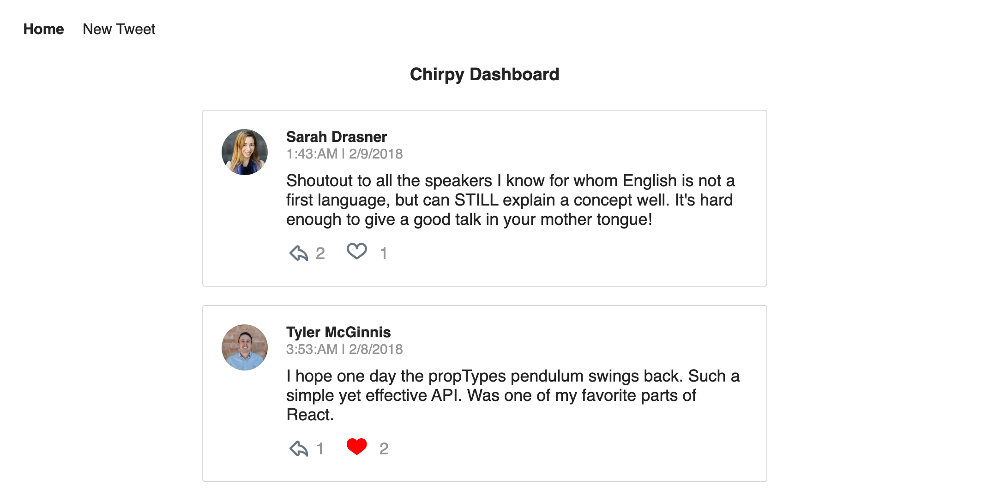
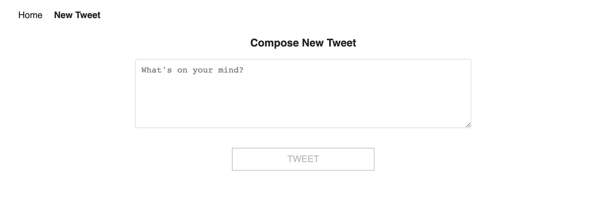

# ReactND-Chirpy
Chirpy is a twitter clone's frontend built using React and Redux
It uses following concepts
* ReactJS
* Redux
* Redux Thunk
* React Router

## Instructions to run the app

To get started using this app right away:

* Install all project dependencies with `npm install`
* Start the server with `npm start`
* Visit http://localhost:3000/

* **_Home Page_**

* **_New Tweet Page_**

* **_Tweet Details Page_**
